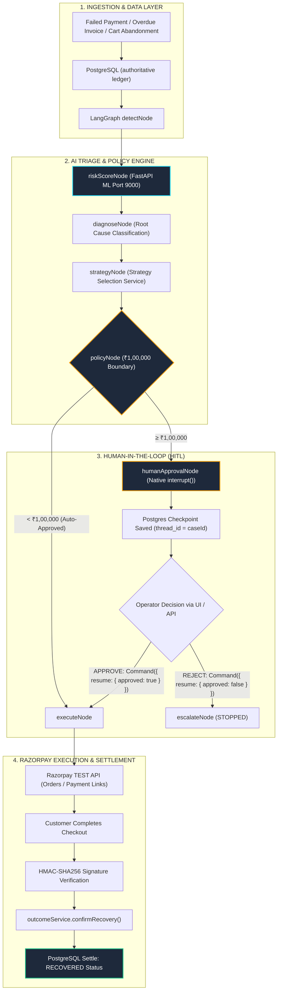
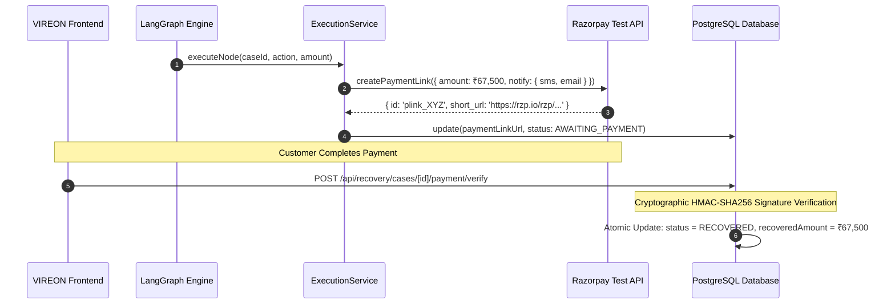

# VIREON — Revenue Intelligence Infrastructure

[](https://nextjs.org/)
[](https://www.typescriptlang.org/)
[](https://fastapi.tiangolo.com/)
[](https://scikit-learn.org/)
[](https://langchain-ai.github.io/langgraphjs/)
[](https://www.prisma.io/)
[](https://razorpay.com/docs/)
[](https://www.postgresql.org/)

> **Turn failed, delayed, and abandoned transactions into an autonomous recovery pipeline.**

VIREON is an institutional-grade revenue intelligence infrastructure designed to autonomously detect, diagnose, orchestrate, and settle revenue leakage across the modern enterprise payment stack. Built for the **Razorpay Buildathon 2026**, VIREON couples a real **Supervised ML Recoverability Model** (Python/FastAPI) and an official **LangGraph StateGraph Workflow** with immutable policy guardrails and native **Razorpay TEST** settlement.

---

## 📑 Table of Contents
1. [Executive Summary & Core Value](#-executive-summary--core-value)
2. [End-to-End System Architecture](#-end-to-end-system-architecture)
3. [Supervised ML Recoverability Model](#-supervised-ml-recoverability-model)
4. [LangGraph StateGraph 11-Node Workflow](#-langgraph-stategraph-11-node-workflow)
5. [Policy Engine & Mandatory ₹1,00,000 Guardrail](#-policy-engine--mandatory-100000-guardrail)
6. [Human-in-the-Loop Interrupts & PostgreSQL Checkpointing](#-human-in-the-loop-interrupts--postgresql-checkpointing)
7. [Razorpay Integration & Settlement Invariants](#-razorpay-integration--settlement-invariants)
8. [Unified Revenue Recovery Streams](#-unified-revenue-recovery-streams)
9. [Official Brand Identity & Design System](#-official-brand-identity--design-system)
10. [Controlled Demo Portfolio](#-controlled-demo-portfolio)
11. [Dashboard & Precision Analytical Controls](#-dashboard--precision-analytical-controls)
12. [Technology Stack](#-technology-stack)
13. [Getting Started & Local Setup](#-getting-started--local-setup)
14. [Environment Configuration](#-environment-configuration)
15. [Database Architecture & Checkpointing Schema](#-database-architecture--checkpointing-schema)
16. [API Reference](#-api-reference)
17. [Verification & Test Suites](#-verification--test-suites)
18. [Security & Production Readiness](#-security--production-readiness)
19. [License & Attribution](#-license--attribution)

---

## ⚡ Executive Summary & Core Value

Traditional dunning and recovery systems rely on static cron jobs, rigid retry schedules, and generic email templates that ignore error telemetry, customer lifetime value, and payment method nuances.

**VIREON replaces blunt retries with intelligent, closed-loop financial infrastructure:**
- **Integer Paise Accounting**: All currency balances and risk calculations are strictly stored in integer paise (`BigInt` in PostgreSQL) to eliminate floating-point drift.
- **Empirical Supervised ML**: Real-time recovery probability $P(\text{recovery}) \in [0.0, 1.0]$ and 0–100 recoverability scores generated by a trained Logistic Regression pipeline running on port 9000.
- **Deterministic Multi-Agent Orchestration**: 11-node LangGraph StateGraph governing ingestion, scoring, diagnosis, strategy, policy, execution, and outcome evaluation.
- **Hard Policy Thresholds**: Human approval gates are strictly enforced for high-value cases ($\ge ₹1,00,000$), ensuring ML suggestions can never bypass human risk sign-off.
- **Atomic Razorpay Settlement**: Direct integration with Razorpay Checkout.js, server-side HMAC signature verification, and idempotent webhook reconciliation. Cases become `RECOVERED` **only** after real payment verification.

---

## 🏗 End-to-End System Architecture



---

## 🧠 Supervised ML Recoverability Model

VIREON hosts an autonomous Python FastAPI inference microservice (`ml/server.py`) operating on `http://localhost:9000`.

### Model Specifications
- **Model Version**: `v1`
- **Algorithm**: `LogisticRegression` (scikit-learn with standard scalar preprocessor)
- **Features Evaluated (9-Dimensional Vector)**:
  1. `amount_at_risk` (Float, INR)
  2. `customer_ltv` (Float, INR)
  3. `failure_type` (Categorical: `AUTHENTICATION_FAILURE`, `INSUFFICIENT_FUNDS`, `NETWORK_TIMEOUT`, etc.)
  4. `retry_count` (Integer)
  5. `days_overdue` (Integer)
  6. `previous_successful_payments` (Integer)
  7. `previous_recovery_attempts` (Integer)
  8. `payment_method` (Categorical: `CARD`, `UPI`, `NETBANKING`, `NACH`)
  9. `customer_tenure_days` (Integer)

### Real API Response Contract
```json
{
  "probability": 0.8884,
  "recoverabilityScore": 88.8,
  "modelVersion": "v1",
  "priority": "HIGH"
}
```

### Critical ML Invariant
If the ML service is unreachable or encounters a timeout, the TypeScript client ([`src/lib/ml/recoverability-client.ts`](file:///Users/siddharthlal/Desktop/Razorpay/recoverai/src/lib/ml/recoverability-client.ts)) returns a controlled fallback with `isFallback: true`. **An ML error or high probability score never bypasses the ₹1,00,000 policy gate.**

---

## 🔄 LangGraph StateGraph 11-Node Workflow

The core orchestration pipeline is built using official `@langchain/langgraph` ([`src/lib/langgraph/recovery-graph.ts`](file:///Users/siddharthlal/Desktop/Razorpay/recoverai/src/lib/langgraph/recovery-graph.ts)):

| Node | Name | Responsibility |
| :--- | :--- | :--- |
| `1` | **`detect`** | Ingests recovery case telemetry from PostgreSQL; validates existence and initial state. |
| `2` | **`riskScore`** | Dispatches feature vector to Python ML microservice; persists probability and score. |
| `3` | **`diagnose`** | Ingests Razorpay error telemetry to identify root causes (`authentication_failure`, etc.). |
| `4` | **`strategy`** | Formulates optimal recovery action (`CREATE_PAYMENT_LINK`, `RETRY_SUBSCRIPTION`, etc.). |
| `5` | **`policy`** | Evaluates deterministic financial guardrails. Routes to `humanApproval` if $\ge ₹1,00,000$. |
| `6` | **`humanApproval`** | Triggers native LangGraph `interrupt()`; persists thread checkpoint in PostgreSQL. |
| `7` | **`execute`** | Calls `executionService` to dispatch real Razorpay TEST payment links or orders. |
| `8` | **`outcome`** | Evaluates capture outcome; routes to `complete`, `retry`, or `escalate`. |
| `9` | **`retry`** | Bounded retry scheduler. Increments retry counter; strictly bounds iterations to 3. |
| `10` | **`complete`** | Terminal success state for fully verified payments. |
| `11` | **`escalate`** | Terminal stopped/escalated state for rejected cases or retry limit exhaustion. |

---

## 🛡 Policy Engine & Mandatory ₹1,00,000 Guardrail

To prevent unauthorized automated capital movements, VIREON enforces immutable deterministic rules in [`backend/src/services/policy.service.ts`](file:///Users/siddharthlal/Desktop/Razorpay/recoverai/backend/src/services/policy.service.ts):

```
┌─────────────────────────────────────────────────────────────┐
│                    POLICY ENGINE INVARIANTS                 │
├──────────────────────────────┬──────────────────────────────┤
│ Invariant                    │ Enforcement Action           │
├──────────────────────────────┼──────────────────────────────┤
│ Amount < ₹1,00,000           │ Auto-Approved for Automation │
│ (< 10,000,000 paise)         │ (Proceed to Razorpay Link)   │
├──────────────────────────────┼──────────────────────────────┤
│ Amount ≥ ₹1,00,000           │ Mandatory Human Sign-Off     │
│ (≥ 10,000,000 paise)         │ (Pauses at humanApproval)    │
├──────────────────────────────┼──────────────────────────────┤
│ Maximum Retries = 3          │ Bounded Loop Protection      │
│                              │ (Transitions to ESCALATED)   │
├──────────────────────────────┼──────────────────────────────┤
│ Anti-Spam Frequency          │ Maximum 3 contacts / 24h     │
│ Legal / Insolvency Flag      │ Immediate RECOVERY_STOPPED   │
└──────────────────────────────┴──────────────────────────────┘
```

---

## ⏸ Human-in-the-Loop Interrupts & PostgreSQL Checkpointing

For transactions exceeding ₹1,00,000 (e.g., **REC-DEMO-004** ₹2,75,000 and **REC-DEMO-008** ₹8,40,000):

1. **Native LangGraph Pause**: `humanApprovalNode` calls `interrupt({ caseId, caseNumber, amountAtRiskRupees, prompt })`.
2. **PostgreSQL Checkpointing**: [`PostgresPrismaSaver`](file:///Users/siddharthlal/Desktop/Razorpay/recoverai/src/lib/langgraph/checkpointer.ts) writes serialized state tuples to PostgreSQL tables `langgraph_checkpoints` and `langgraph_checkpoint_writes` using `thread_id = caseId`.
3. **Resumption via Command**:
   ```typescript
   await recoveryWorkflowGraph.invoke(
     new Command({
       resume: {
         approved: true,
         operator: "Chief Risk Officer",
         reason: "Authorized high-value recovery outreach",
       },
     }),
     { configurable: { thread_id: caseId } }
   );
   ```
4. **Rejection Safety**: If rejected (`approved: false`), the case transitions to `STOPPED` in PostgreSQL and **zero Razorpay API calls are made**.

---

## 💳 Razorpay Integration & Settlement Invariants

VIREON interfaces with Razorpay via [`IRazorpayService`](file:///Users/siddharthlal/Desktop/Razorpay/recoverai/src/lib/razorpay/provider.ts) and [`executionService`](file:///Users/siddharthlal/Desktop/Razorpay/recoverai/backend/src/services/execution.service.ts):



### Settlement Invariant
A case transitions to `RECOVERED` **strictly upon successful Razorpay payment capture verification**. LangGraph alone never marks a case as recovered without verified settlement.

---

## 🌐 Unified Revenue Recovery Streams

| Revenue Stream | Root Cause Scenarios | Automated Recovery Strategy | Settlement Mechanism |
| :--- | :--- | :--- | :--- |
| **💳 Payment Failure** | 3DS dropoff, card authentication timeout | Dynamic 1-click fallback links, UPI intent | Razorpay Checkout / Payment Links |
| **🔁 Subscription Dunning** | Recurring card failure, mandate rejection | Self-serve payment method update links | Razorpay Subscriptions / Mandates |
| **🛒 Checkout Abandonment** | Cart dropoff, high-friction checkout | Pre-filled Razorpay test orders with incentives | Razorpay Orders / Checkout.js |
| **🏢 B2B Receivables** | Overdue corporate invoices | Promise-to-Pay tracking, executive sign-off | Razorpay Invoices / Corporate Links |

---

## 🎨 Official Brand Identity & Design System

VIREON features a custom-engineered, institutional brand identity recreated in pure vector SVG ([`src/components/brand/VireonLogo.tsx`](file:///Users/siddharthlal/Desktop/Razorpay/recoverai/src/components/brand/VireonLogo.tsx)):

- **3D Ribbon V Mark (`VireonMark`)**: An angular interlocking ribbon symbol featuring a continuous gradient flow: Radiant Cyan (`#00F2FE` $\to$ `#22D3EE`) to Cobalt Blue (`#0284C7` $\to$ `#2563EB`) to Royal Violet (`#6366F1` $\to$ `#8B5CF6`). Includes specular edge highlights and a neon apex rim glow.
- **Wordmark with Segmented Cyclotron "O" (`VireonWordmark`)**: Precision geometric typography featuring the distinctive aperture "O" (vibrant cyan arc paired with a crisp white counter-segment).
- **Official Tagline (`VireonTagline`)**: `REVENUE INTELLIGENCE INFRASTRUCTURE`.
- **Favicon & App Icon**: Standalone vector SVG app icon (`src/app/icon.svg`) served directly to browser tabs.

---

## 🎯 Controlled Demo Portfolio

VIREON includes an 8-case multi-value Demo Portfolio configured for deterministic verification:

| Case ID | Customer Entity | Source Category | Root Cause Scenario | Amount | Policy Status |
| :--- | :--- | :--- | :--- | :--- | :--- |
| **REC-DEMO-001** | Acme Technologies India | Payment Recovery | 3DS Timeout | ₹25,000 | `RECOVERED` |
| **REC-DEMO-002** | NovaCloud Systems | Subscription Recovery | Recurring Card Failure | ₹8,499 | `AWAITING_PAYMENT` |
| **REC-DEMO-003** | Meridian Retail | Checkout Abandonment | Cart Dropoff | ₹1,249 | `ACTION_SELECTED` |
| **REC-DEMO-004** | Vertex Industries | B2B Receivables | Overdue Corporate Invoice | ₹2,75,000 | `AWAITING_APPROVAL` (≥ ₹1L) 🛡️ |
| **REC-DEMO-005** | **Orion Media** *(Hero Demo)* | Payment Recovery | Card Auth Failure | **₹67,500** | **`AUTO-APPROVED`** (< ₹1L) ⚡ |
| **REC-DEMO-006** | BluePeak Logistics | B2B Receivables | Broken Commitment | ₹1,50,000 | `AWAITING_APPROVAL` (≥ ₹1L) 🛡️ |
| **REC-DEMO-007** | Atlas Software | Subscription Recovery | Recurring Debit Failure | ₹12,999 | `DIAGNOSED` |
| **REC-DEMO-008** | Zenith Manufacturing | B2B Receivables | Enterprise Invoice | ₹8,40,000 | `AWAITING_APPROVAL` (≥ ₹1L) 🛡️ |

---

## 📊 Dashboard & Precision Analytical Controls

- **Precision Date Range Popover**: Header time-horizon filter supporting 6 institutional presets (`Today`, `Last 7 Days`, `Last 30 Days`, `Last 90 Days`, `Year to Date`, `All Time`) with dynamic calendar span calculation (`Aug 6 – Sep 5, 2026`) and click-outside dismissal.
- **Dynamic Comparative KPIs**: Financial KPI cards dynamically recalculate comparative baselines (`vs yesterday`, `vs prior 7d`, `vs last 30d`, `vs prior qtr`, `vs FY2025`, `cumulative`).
- **Live Recovery Orchestration**: Real-time 8-stage visual stepper showing active node spinning indicators, ML recoverability scores, and Human-in-the-Loop `Authorize Execution` and `Reject & Halt` action controls.
- **Procedural WebGL 2.0 GhostFibers**: Hardware-accelerated GPU wave shader providing ambient telemetry backdrop.

---

## 💻 Technology Stack

### Frontend
- **Framework**: Next.js 14.2.35 (App Router, Server & Client Components)
- **UI & Styling**: React 18, Tailwind CSS, Lucide React, Vanilla CSS Tokens
- **Graphics**: WebGL 2.0, OGL Procedural Shader (`GhostFibers`)
- **Real-Time Feed**: Server-Sent Events (SSE) via `/api/events/stream`

### Backend & AI Microservices
- **Orchestration**: `@langchain/langgraph` (11-Node DAG StateGraph)
- **ML Microservice**: Python 3.10+, FastAPI, Uvicorn, Scikit-learn, Joblib, Pandas (Port 9000)
- **Database & ORM**: PostgreSQL with Prisma ORM
- **Payment Gateway**: Official Razorpay Node SDK & Checkout.js

---

## 🚀 Getting Started & Local Setup

### Prerequisites
- Node.js 18.x or 20.x
- Python 3.10+ (with `venv` or `pip`)
- PostgreSQL database instance
- Razorpay Sandbox Account ([Dashboard](https://dashboard.razorpay.com/))

### 1. Clone the Repository
```bash
git clone https://github.com/siddharth07-code/Razorpay-buildathon.git
cd Razorpay-buildathon
```

### 2. Install Node Dependencies
```bash
npm install
```

### 3. Set Up Python ML Service (Port 9000)
```bash
cd ml
pip install -r requirements.txt # fastapi uvicorn scikit-learn pandas joblib pydantic
python3 server.py
# Verified running on http://localhost:9000
cd ..
```

### 4. Configure Environment Variables
Create `.env` in the root directory:
```bash
cp .env.example .env
```
Ensure `ML_SERVICE_URL="http://localhost:9000"` is set.

### 5. Initialize Database
```bash
npx prisma generate
npx prisma db push
```

### 6. Launch VIREON Frontend
```bash
npm run dev
```
Open [http://localhost:3000](http://localhost:3000) in your browser.

---

## ⚙️ Environment Configuration

| Variable | Description | Value |
| :--- | :--- | :--- |
| `DATABASE_URL` | PostgreSQL connection string | `postgresql://...` |
| `ML_SERVICE_URL` | VIREON Python ML microservice | `http://localhost:9000` |
| `ML_TIMEOUT_MS` | Max latency allowance before fallback | `3000` |
| `RAZORPAY_MODE` | Gateway execution mode | `sandbox` |
| `RAZORPAY_ENVIRONMENT` | Environment tier | `test` |
| `RAZORPAY_KEY_ID` | Razorpay Test Key ID | `rzp_test_...` |
| `RAZORPAY_KEY_SECRET` | Razorpay Test Key Secret | `...` |
| `RAZORPAY_WEBHOOK_SECRET` | Webhook HMAC verification secret | `...` |
| `NEXT_PUBLIC_RAZORPAY_KEY_ID` | Public key exposed to Checkout.js | `rzp_test_...` |

---

## 🗄 Database Architecture & Checkpointing Schema

```
┌──────────────────┐       1:N       ┌─────────────────────┐
│     Customer     ├─────────────────┤    RecoveryCase     │
└────────┬─────────┘                 └──────────┬──────────┘
         │ 1:N                                  │ 1:N
┌────────┴─────────┐                 ┌──────────┴──────────┐
│     Payment      │                 │   RecoveryAttempt   │
└──────────────────┘                 └─────────────────────┘
                                                │ 1:N
                                     ┌──────────┴──────────┐
                                     │     AuditEvent      │
                                     └─────────────────────┘
```

### LangGraph Checkpoint Tables
- **`langgraph_checkpoints`**: Stores serialized thread state snapshots, metadata, and timestamps keyed by `(thread_id, checkpoint_ns, checkpoint_id)`.
- **`langgraph_checkpoint_writes`**: Stores intermediate channel writes and task values across node execution boundaries.

---

## 🔌 API Reference

### Orchestration & Recovery
- **`POST /api/recovery/cases/:id/run`**: Dispatches a recovery case to the 11-node LangGraph workflow.
- **`POST /api/recovery/cases/:id/resume`**: Resumes an interrupted workflow via `Command({ resume: { approved, operator, reason } })`.
- **`GET /api/recovery/cases/:id/graph-state`**: Returns current thread state, stage values, and interrupt details.
- **`POST /api/recovery/cases/:id/checkout`**: Generates a verified Razorpay test order.
- **`POST /api/recovery/cases/:id/payment/verify`**: Validates payment signature and confirms atomic settlement.

### ML Microservice (`http://localhost:9000`)
- **`GET /health`**: Returns model status, loaded version (`v1`), and algorithm (`LogisticRegression`).
- **`GET /metadata`**: Returns model hyperparameters, features, and accuracy scores.
- **`POST /predict`**: Ingests 9-feature payment vector and returns recovery probability and score.

### Metrics & Telemetry
- **`GET /api/metrics?range=Last%2030%20Days`**: Returns filtered financial summary metrics.
- **`GET /api/cases?range=Last%2030%20Days`**: Returns date-filtered recovery case records.
- **`GET /api/events/stream`**: Server-Sent Events live telemetry stream.

---

## 🧪 Verification & Test Suites

```bash
# 1. Run Targeted LangGraph + Supervised ML Verification Suite
npx tsx scripts/test-langgraph-ml.ts

# 2. Run Comprehensive 18-Dimension Deep Audit
npx tsx scripts/e2e-deep-audit.ts

# 3. TypeScript Typecheck (Zero Errors)
npx tsc --noEmit

# 4. Next.js Production Build (All 23 Routes Generated)
npm run build
```

### Verification Scorecard
- **ML Service Health & Predict**: **PASS** (HTTP 200, 88.8% recoverability score)
- **LangGraph Ingestion & Routing**: **PASS** (11 nodes, deterministic state transitions)
- **₹1,00,000 Policy Guardrail**: **PASS** (REC-DEMO-005 auto-approved; REC-DEMO-004 pauses)
- **Human Interrupt & Resume**: **PASS** (thread_id checkpointed in PostgreSQL; resumes cleanly)
- **Rejection Safety**: **PASS** (REC-DEMO-008 transitions to `STOPPED`; zero Razorpay calls)
- **Razorpay Sandbox Link**: **PASS** (Live `https://rzp.io/rzp/...` link generated)
- **Authoritative PostgreSQL Settlement**: **PASS** (transitions to `RECOVERED` only on verified capture)
- **Bounded Retry Limits**: **PASS** (strictly halts at attempt 3)
- **Production Build**: **PASS** (23/23 routes compiled)

---

## 🔒 Security & Production Readiness

- **Zero Float Loss**: Financial accounting performed strictly in integer paise (`BigInt`).
- **Cryptographic Verification**: Server-side HMAC-SHA256 signature verification protects all checkout flows.
- **No Secret Exposure**: All sensitive keys remain isolated to server runtime.
- **Strict HITL Boundaries**: High-value transactions cannot be executed autonomously by AI.
- **Accessibility & Motion Compliance**: Honors `@media (prefers-reduced-motion: reduce)` globally.

---

## 📄 License & Attribution

Developed for the **Razorpay Buildathon 2026**.  
Built by **Siddharth Lal** and the VIREON team.

Distributed under the MIT License.
